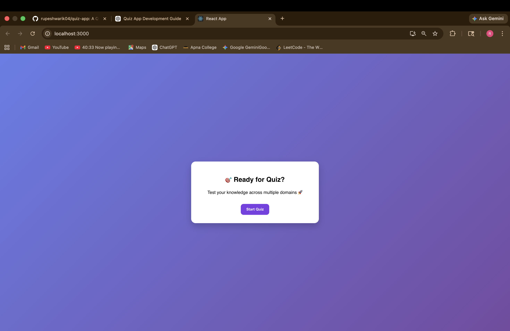
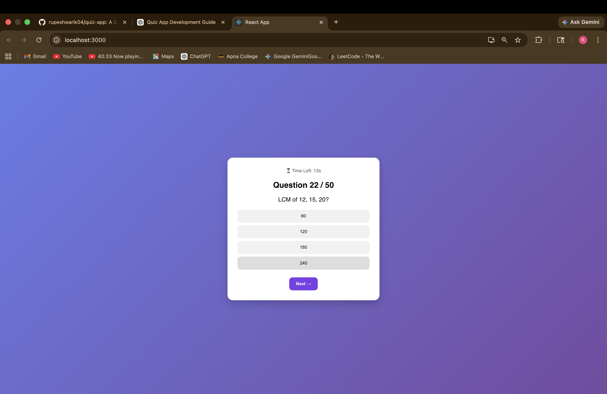
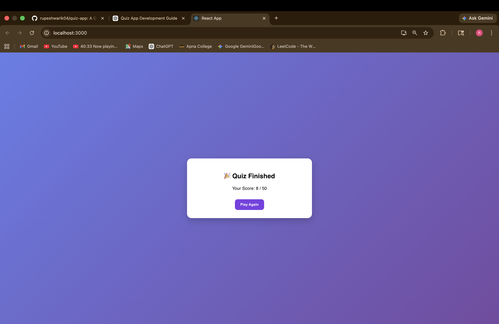

# 🧠 Quiz App

A web-based quiz application that allows users to answer questions and get instant results.

---

## 🚀 Features

* Multiple choice questions
* Score calculation
* Interactive UI
* Fast and responsive

---

## 🛠 Tech Stack

* Frontend: React.js
* Backend: Node.js
* Database: (add if used)

---

## 📸 Screenshots

(Add screenshots here later)

---

## ⚙️ How to Run

1. Clone the repository
2. Install dependencies using `npm install`
3. Run using `npm start`

---

## 🎯 Future Improvements

* Add timer
* Add leaderboard
* Add authentication

---
## 📸 Screenshots

### 🏠 Home Page

### ❓ Quiz Page

### 📊 Result Page

⭐️ If you like this project, give it a star!
